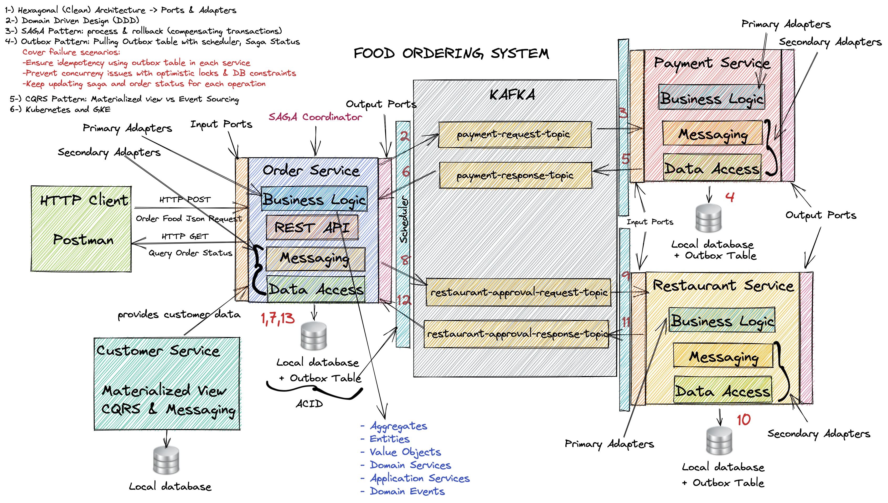
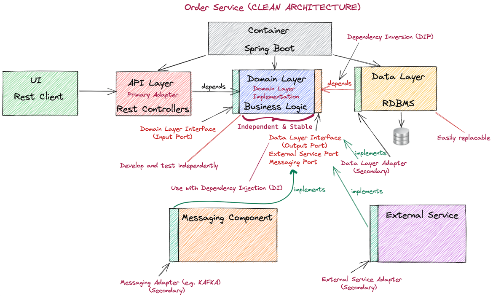
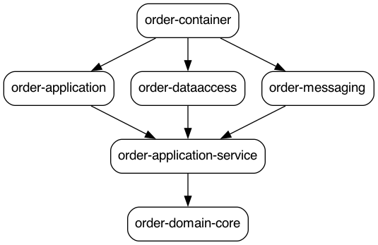

## Architecture

## Microservices 
### Microservices advantages and disadvantages

Advantages of microservices:

- independent development and deployment by different teams
- easy to scale for a specific ser vice
- better fault isolation
- enabled to use different technology and languages for different service

Disadvantages: 

- need to use microservice patterns and orchestration tools for common problems

### Clean, Onion & Hexagonal Architecture

Isolate the domain logic from outside dependencies (dependencies, messaging tools etc.)

Long lasting applications easily adaptable to new technologies.

**Dependency inversion** - high level modules should not depend on low level modules. Both should depend on abstraction

### Domain Driven Design (DDD)

Bounded context, entities, aggregates, value objects, domain services, application services, domain events.

Strategic DDD - mapping business domain and bounded context for the domain model

Tactical DDD - implement domain model with aggregates, entities, value objects, services and events

### Kafka

Event store for event-driven services. Enable loosely coupled services that communicates through events.

Resiliency with replicated sics store & scalability with partitioning strategy.

### Saga

Distrubuted long running transactions across services. Used for long lived transactions. First invented in a publication on 1987

Chain of local ACID transaction.

- atomicity
- consistency
- isolation
- durability

**Saga with choreography -** Saga based on events - local transactions publish domain events that trigger local transactions in other services.

**Saga with orchestration -** orchestrator coordinates the participants to run local transactions.

### Outbox

Help use of local ACID transactions to let consistent (eventual) distributed transactions. It will complete SAGA in a safe and consistent way.

Local ACID transaction + event publishing operation leads to possible consistency problems

**Possible solutions:**

- event sourcing - use an event log as primary source for your data - but in most of the cases we want to have local acid transactions
- outbox pattern - we don’t publish events directly but instead we keep them in local outbox table
    - CDC - change data capture - listens transaction logs of the outbox table
    - Pulling outbox table - pull the events from outbox table with a Scheduler

### CQRS

Command Query Responsibility Segregation - separate read and write operations. Better performance on read part using right technology for reading, and preventing conflicts with update commands. Scale each part separately. Leads to eventual consistency.

Develop, manage and scale read and write parts of a system.

### Kubernetes & Docker

Kubernetes is a container orchestration system that automates deployment, scaling and management of cloud native applications. It allows to run docker container while reducing operational complexities.

### Google Clound & Google Kubernetes Engine

Google’s solution for cloud computing. GKE is a managed, production ready environment for running containerized applications.

# Ordering Microservice architecture
## Architecture
Architecture is made with use of Clean Architecture
- Port & Adapters
- Domain Layer is isolated, in the middle of the system and has not any dependencies.
- Adapters have dependencies to Domain Layers

## Dependency graph
Implemented as per architecture. Only container module has access to all modules.
- Business layer (order-application-service / order-domain-core) has no dependency

     